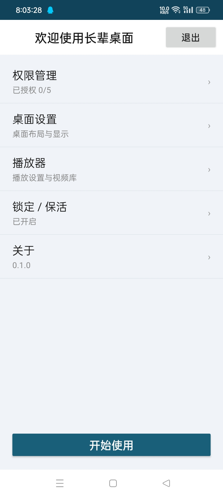
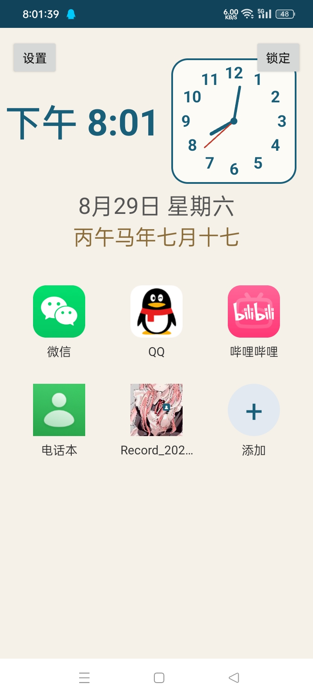
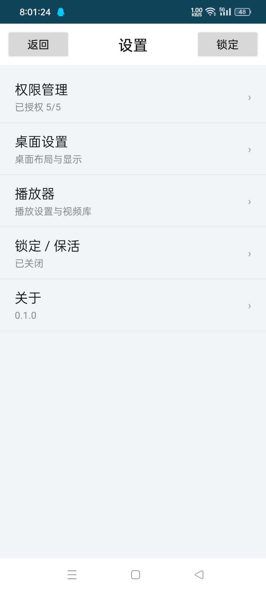
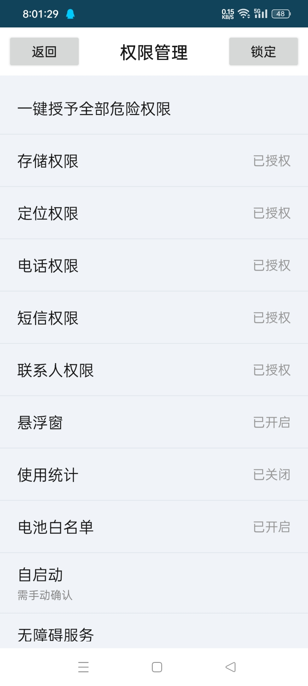
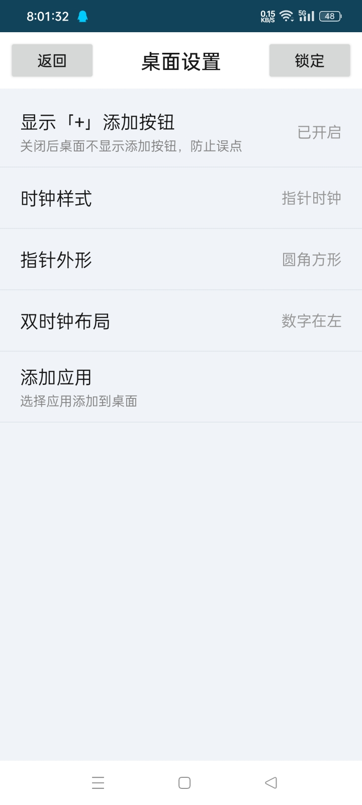
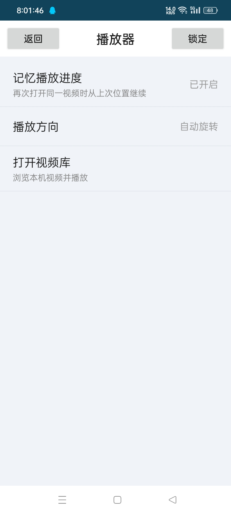
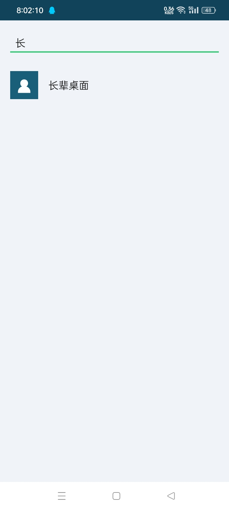
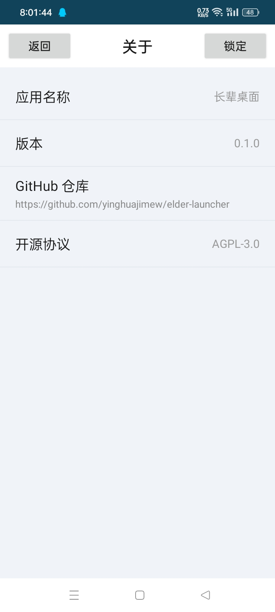

<h1 align="center">长辈桌面</h1>

<!-- SHIELD GROUP -->
[![Version][version-shield]][version-link]
[![License][license-shield]][license-link]
[![Issues][issues-shield]][issues-link]

[![Forks][forks-shield]][forks-link]
[![Stars][stars-shield]][stars-link]
[![Contributors][contributors-shield]][contributors-link]

中文 · [变更日志](./CHANGELOG.zh-CN.md)

 

> [!TIP]
> 为长辈打造的极简桌面：大字体、大图标、语音播报，子女可远程守护。

> [!WARNING]
> 本项目仍在开发中，尚有功能待完善。 
> **此应用代码由 deepseek v4 编写** 

> [!TIP]
> 想参与功能添加、功能修改等，请 fork 并提交 PR，或 fork 后自行修补整理。

<kbd>目录</kbd>

#### 目录列表

- [🌸 项目简介](#-项目简介)
- [🖼️ 应用截图](#-应用截图)
- [🚀 快速上手](#-快速上手)
- [📄 更新日志](#-更新日志)
- [🙏 致谢与借鉴](#-致谢与借鉴)
- [📜 开源协议](#-开源协议)

 

## 🌸 项目简介

「长辈桌面」是一款面向老年人的极简桌面（Launcher），把手机变成一个简单、不易误触、子女可守护的界面。

主要特性：

- **大字体大图标**：界面简洁，字号图标都放大，长辈看得清。
- **时钟**：数字时钟、指针时钟（圆形 / 圆角方形、时分秒针、数字刻度）可自由搭配，另有农历显示。
- **应用磁贴**：应用一键添加 / 删除 / 拖动排序，A-Z 索引快速定位。
- **视频播放**：内置播放器，支持播放列表（多选添加）、连续播放、列表跳转、按视频方向自动旋转、锁定防误触。
- **磁贴封面**：视频磁贴可自动截帧或自定义图片作封面，随时更换。
- **无障碍服务**：通知朗读、点读、前台应用监听。
- **锁定 / 保活**：锁定模式、开机自启、无障碍保活，防止误触或误退出。
- **集中设置**：权限管理、桌面设置、播放器设置、锁定、关于。
- **固定签名**：debug / release 共用同一密钥，升级免卸载。

## 🖼️ 应用截图

<kbd>🌸 查看界面预览</kbd>

   
  
   
  
   
  
   
  
   
  
   
  
   
  
   
  
   

## 🚀 快速上手

### 📺 使用介绍

介绍与使用教程：

<!-- 视频链接待补充

-->

> [!TIP]
> **支持 Android 6 ~ 10** 
> 将「长辈桌面」设为默认桌面后，锁定 / 保活效果最完整； 
> 需按引导授予危险权限并开启无障碍服务、自启动等特殊权限。

## 📄 更新日志

详见 [CHANGELOG.zh-CN.md](./CHANGELOG.zh-CN.md)

## 🙏 致谢与借鉴

本项目借鉴 / 使用了以下开源项目：

- [Next Player](https://github.com/anilbeesetti/nextplayer) — 视频播放器（GPL-3.0），播放逻辑与功能参考
- [AndroidX Media3 / ExoPlayer](https://github.com/androidx/media) — 视频播放内核
- [pinyin4j](https://github.com/belerweb/pinyin4j) — 应用名中文拼音排序
- [AndroidX](https://developer.android.com/jetpack/androidx) — 基础组件库

## 📜 开源协议

本项目采用 **[AGPL 3.0](https://www.gnu.org/licenses/agpl-3.0)** 协议。

<!-- 底部链接定义 -->

[version-shield]: https://img.shields.io/badge/版本-v0.1.0-369eff?style=flat-square&labelColor=black
[version-link]: https://github.com/yinghuajimew/elder-launcher/releases

[issues-shield]: https://img.shields.io/github/issues/yinghuajimew/elder-launcher?color=ff80eb&labelColor=black&style=flat-square
[issues-link]: https://github.com/yinghuajimew/elder-launcher/issues

[forks-shield]: https://img.shields.io/github/forks/yinghuajimew/elder-launcher?color=8ae8ff&labelColor=black&style=flat-square
[forks-link]: https://github.com/yinghuajimew/elder-launcher/network/members

[stars-shield]: https://img.shields.io/github/stars/yinghuajimew/elder-launcher?color=ffcb47&labelColor=black&style=flat-square
[stars-link]: https://github.com/yinghuajimew/elder-launcher/stargazers

[contributors-shield]: https://img.shields.io/github/contributors/yinghuajimew/elder-launcher?color=c4f042&labelColor=black&style=flat-square
[contributors-link]: https://github.com/yinghuajimew/elder-launcher/graphs/contributors

[license-shield]: https://img.shields.io/badge/license-AGPL_3.0-blue?style=flat-square&labelColor=black
[license-link]: https://www.gnu.org/licenses/agpl-3.0
